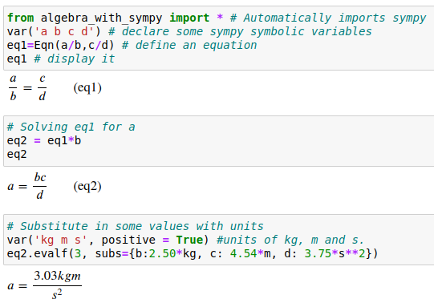

## Algebraic Equations with SymPy

[Introduction](#introduction) | [Installation](#setupinstallation) |
[Try Live](#try-in-binder) | [Issues or Comments](#issues-or-comments) |
[Change Log](#change-log) |
[License](#this-software-is-distributed-under-the-gnu-v3-licensehttpsgnuorglicenses)

#### Introduction

This tool defines relations that all high school and college students would
recognize as mathematical equations. 
They consist of a left hand side (lhs) and a right hand side (rhs) connected by
the relation operator "=".

This tool applies operations to both sides of the equation simultaneously, just
as students are taught to do when 
attempting to isolate (solve for) a variable. Thus the statement `Equation/b`
yields a new equation `Equation.lhs/b = Equation.rhs/b`

The intent is to allow using the mathematical tools in SymPy to rearrange
equations and perform algebra
in a stepwise fashion using as close to standard mathematical notation as 
possible. In this way more people can successfully perform 
algebraic rearrangements without stumbling
over missed details such as a negative sign.

A simple example as it would appear in a [Jupyter](https://jupyter.org) 
notebook is shown immediately below:

Once the algebra is complete it is possible to substitute numbers with 
units into the solved equation to calculate a numerical solution with 
proper units.

[More examples here](docs/Demonstration%20of%20equation%20class.html).

Many math packages such as [SageMath](https://www.sagemath.org/) 
and [Maxima](http://maxima.sourceforge.net/) have similar capabilities, 
but require more knowledge of command syntax, plus they cannot easily be 
installed in a generic python environment.

#### Setup/Installation

1. Use pip to install in your python environment: 
`pip install -U Algebra_with_SymPy`
2. To use in a running python session issue
the following command : `from algebra_with_sympy import *`. 
This will also import the SymPy tools. 
3. If you want to isolate this tool from the global namespace you are 
   working with change the import statement 
to `import algebra_with_sympy as spa`, where 
`spa` stands for "SymPy Algebra". Then all calls would be made to `
spa.funcname()`.

#### Try in binder

#### Issues or Comments

* Issues and bug reports should be [filed on 
github](https://github.com/gutow/Algebra_with_Sympy/issues).
* Comments, questions, show and tell, etc. should go in the [project 
  discussions](https://github.com/gutow/Algebra_with_Sympy/discussions).

#### Change Log

* 0.9.1
  * Equations labeled with their python name, if they have one.
  * Added flags to adjust human readable output and equation labeling.
  * Accept equation as function argument in any position.
  * First pass as `solve()` accepting equations.
  * Added override of `root()` to avoid warning messages.
  * More unit tests.
  * First pass at documentation.
* 0.9.0 functionality equivalent to extension of SymPy in
[PR#21333](https://github.com/sympy/sympy/pull/21333).

##### [This software is distributed under the GNU V3 license](https://gnu.org/licenses)

This program is free software: you can redistribute it and/or modify
    it under the terms of the GNU General Public License as published by
    the Free Software Foundation, either version 3 of the License, or
    (at your option) any later version.
    This program is distributed in the hope that it will be useful,
    but WITHOUT ANY WARRANTY; without even the implied warranty of
    MERCHANTABILITY or FITNESS FOR A PARTICULAR PURPOSE.  See the
    GNU General Public License for more details.

Copyright - Jonathan Gutow 2021, 2022